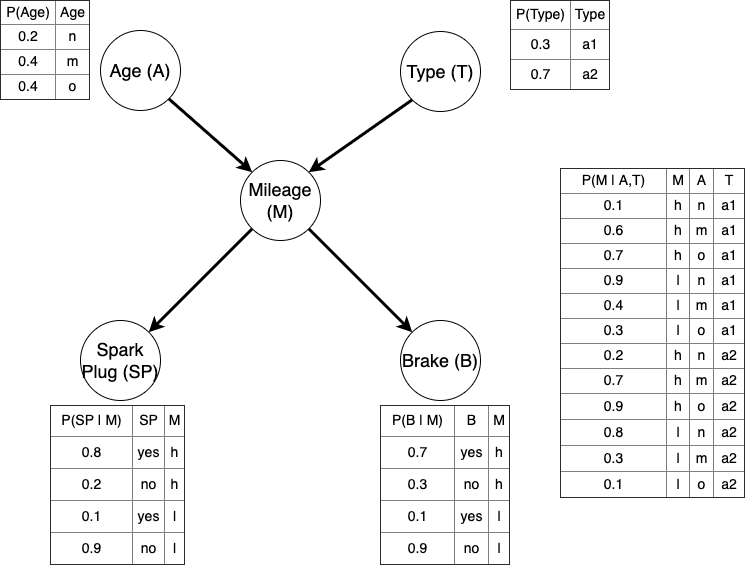

# Estudiantes
Carlos
Héctor


# Objetivo

El trabajo consiste en la creación de la *Red Bayesiana* `Garage` y realizar ejercicios de inferencia. Se hará uso de los paquetes `bnlearn` y `gRain`.

Un taller dispone de una *Red Bayesiana* para modelizar las probabilidades de su día a día. Los vehículos están caracterizados con las variables Edad (A), Tipo (T), Kilometraje (M) y si necesitan cambios de bujías (SP) y/o frenos (B)



# Red Bayesiana

## Distribución de probabilidad

Escribe de manera **factorizada** la función densidad de probabilidad conjunta P(A,T,M,SP,B)

$P(A,T,M,SP,B)= P(A)⋅P(T)⋅P(M∣A,T)⋅P(SP∣M)⋅P(B∣M)$

## Grafo Acíclico Dirigido

Creación del Grafo Acíclico Dirigido según probabilidad factorizada.

```{r}
library(bnlearn)
#solucion
dag<- model2network("[A][T][M|A:T][SP|M][B|M]")
plot(dag)
graphviz.plot(dag, layout = "dot", shape = "ellipse")
```

## CPT, Tablas de probabilidad condicionada

Crea las matrices/arrays de probabilidad condicionada para cada nodo para la creación de una red bayesiana discreta según la librería `bnlearn`.

```{r}
#AGE
A.lv <- c("n", "m", "0")
A.prob <- array(c(0.2, 0.4, 0.4), dim = 3,dimnames = list(A = A.lv))
A.prob

#TYPE
T.lv <- c("a1", "a2")
T.prob <- array(c(0.3, 0.7), dim = 2,dimnames = list(T = T.lv))
T.prob

#MILEAGE
M.lv <- c("h", "l")
M.prob <- array(c(0.1, 0.9,  # A="n", T="a1"
                  0.6, 0.4,  # A="m", T="a1"
                  0.7, 0.3,  # A="o", T="a1"
                  0.2, 0.8,  # A="n", T="a2"
                  0.7, 0.3,  # A="m", T="a2"
                  0.9, 0.1), # A="o", T="a2"
                dim = c(2, 3, 2), 
                dimnames = list(M = M.lv, A = A.lv, T = T.lv))
M.prob
ftable(M.prob,row.vars = "T", col.vars = "A")
# SPARK PLUG
# Depende de M.
SP.lv <- c("yes", "no")
SP.prob <- array(c(0.8, 0.2,  # M="h"
                   0.1, 0.9), # M="l"
                 dim = c(2, 2), 
                 dimnames = list(SP = SP.lv, M = M.lv))
SP.prob

# BRAKE 
# Depende de M.
B.lv <- c("yes", "no")
B.prob <- array(c(0.7, 0.3,   # M="h"
                  0.1, 0.9),  # M="l"
                dim = c(2, 2), 
                dimnames = list(B = B.lv, M = M.lv))
B.prob

cpt<-list(A = A.prob, T = T.prob, M = M.prob, SP = SP.prob, B = B.prob)
cpt
```

## Red Bayesiana

Unimos el grafo y las distribuciones locales para crear la *Red Bayesiana*.

```{r}
bn <- custom.fit(dag,cpt)
bn
```

# Inferencia

## junction tree

Crea el árbol de inferencia `junction tree` para acelerar los cálculos de las probabilidades condicionadas de manera exacta.

```{r}
library(gRain)
jt<-compile(as.grain(bn))
summary(jt)
plot(jt)
```

## Razonamiento sin Evidencias

Determina las probabilidades del Kilometraje de los vehículos, $P(M)$, sin ninguna información adicional (evidencias). ¿Hay algún resultado más esperable que otro considerando que `h=high` y `l=low`?

```{r}
#solucion
# Consultamos la probabilidad marginal del nodo "M" (Kilometraje) sin evidencias
prob_M <- querygrain(jt, nodes = "M", type = "marginal")

# Imprimimos el resultado
prob_M

```
Es más común  que un vehículo que llegue al taller tenga un kilometraje alto. Concretamente, hay un 63.8% de probabilidad de que el kilometraje sea alto (h=high), frente a solo un 36.2% de probabilidad de que sea bajo (l=low).

Interpreta la etiquetas de la Edad en función del Kilometraje.

```{r}
#solución 
#Para interpretar correctamente las etiquetas de la Edad (A) en función del Kilometraje (M), podemos observar cómo cambia la probabilidad de tener un kilometraje alto (h) o bajo (l) a medida que cambiamos el estado de la edad del vehículo.

#Aunque ya intuimos que n es new (nuevo), m es medium (medio) y o es old (viejo), podemos demostrarlo matemáticamente calculando la probabilidad condicional P(M∣A).

# Probabilidad de Kilometraje para coches Nuevos (n)
jt_An <- setEvidence(jt, nodes = "A", states = "n")
q_M_A_n<-querygrain(jt_An, nodes = "M", type = "marginal")
q_M_A_n

# Probabilidad de Kilometraje para coches de Mediana edad (m)
jt_Am <- setEvidence(jt, nodes = "A", states = "m")
q_M_A_m<-querygrain(jt_Am, nodes = "M", type = "marginal")
q_M_A_m

# Probabilidad de Kilometraje para coches Viejos (o)
jt_Ao <- setEvidence(jt, nodes = "A", states = "o")
q_M_A_o<-querygrain(jt_Ao, nodes = "M", type = "marginal")
q_M_A_o
```

¿Qué combinación de Edad y tipo de coche es menos frecuente?

```{r}
#solución 

```

Determina el Kilometraje medio para cada tipo de coche. Supón que `h=high=150000` y `l=low=50000`

```{r}
#solución 

```

Nos llama la grúa al taller y sabemos que nos llega un coche de tal edad y tipo. ¿Qué probabilidad esperamos de cambiarle los frenos? **Nota: mira la ayuda de querygrain para condicionar por 2 variables**

```{r}
#solución 

```

¿Cuál es la situación más probable (MAP) en nuestro taller? ¿tiene sentido?

```{r}
#solucion

```

## Razonamiento con Evidencias

Determina cómo se modifica la probabilidad de cambiar los frenos si sabemos que el vehículo es viejo. ¿Aumenta o disminuye? ¿(según las diapositivas de clase) es razonamiento evidencial o causal?

```{r}
#solucion

```

Determina cómo se modifica la probabilidad de que el vehículo sea nuevo, cuando sabemos que necesita un cambio de bujías y de frenos. ¿(según las diapositivas de clase) es razonamiento evidencial o causal?

```{r}
#solucion

```

Determina cómo se modifica la probabilidad de la edad para cada tipo de vehículo, cuando sabemos que Kilometraje es alto.

```{r}
#solución 

```

¿Cómo se modifican las expectativas (de las combinaciones) de las reparaciones cuando se modifica el tipo de coche?

```{r}
#solucion

```

Interpreta el siguiente código... ¿cuándo puede ser interesante la versión 2) de la consulta?

```{r}
#consulta1
jtMhard<-setEvidence(jt, nodes=c("M"), states=c("h"))
querygrain(jtMhard,nodes=c("B"),type="marginal")

#consulta2
jtMsoft<-setEvidence(jt, nodes=c("M"), states=list(c("h"=0.75,"l"=0.25)))
querygrain(jtMsoft,nodes=c("B"),type="marginal")

#consulta3
querygrain(jt,nodes=c("B"),type="marginal")
```

# Reto analista.

Plantea 3 preguntas/cuestiones al "Garage". Desarrolla la consulta probabilista y comenta la respuesta.

*Nota: Puedes añadir/quitar cualquier elemento o dato que consideres necesario.*

```{r}

```
